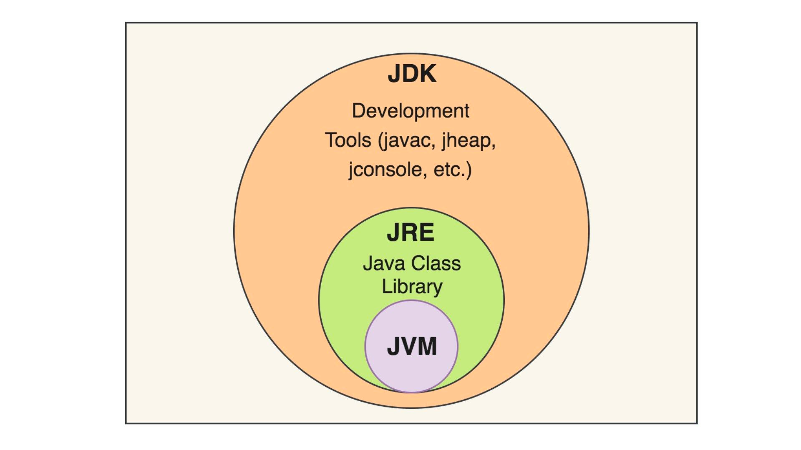

# Lesson 03

## Введение в управление памятью в Java

### Общий обзор: Зачем нужно понимать управление памятью

В программировании на Java понимание управления памятью является ключевым для написания эффективного и надежного кода.
Управление памятью влияет на производительность приложения и является одним из основных источников ошибок, таких как
утечки памяти и проблемы с многопоточностью.

### Предварительная информация: JVM, JDK и JRE

#### Что такое JVM (Java Virtual Machine)?

- **JVM** - это виртуальная машина, которая исполняет байт-код Java. Она является частью JRE и обеспечивает
  платформенную независимость кода, его безопасность и портативность.
- JVM отвечает за загрузку кода, проверку его на безопасность, выполнение и предоставление среды времени выполнения.
- JVM не зависит от операционной системы, что позволяет Java-программам работать на любой системе с установленным
  соответствующим JVM.

#### Что такое JRE (Java Runtime Environment)?

- **JRE** включает в себя JVM и библиотеки классов Java, необходимые для выполнения Java-приложений.
- JRE предоставляет базовую среду для выполнения Java-программ, но не содержит инструменты для разработки, такие как
  компилятор или отладчик.
- JRE подходит для запуска Java-приложений, но не для их разработки.

#### Что такое JDK (Java Development Kit)?

- **JDK** - это полноценный набор для разработки на Java, включающий JRE и инструменты разработки, такие как
  компилятор (`javac`), инструменты для документирования (`javadoc`) и другие утилиты.
- JDK необходим для разработки Java-приложений, так как он предоставляет все необходимые инструменты.
- JDK также включает в себя JRE, что позволяет не только разрабатывать, но и запускать Java-приложения.



### JVM (Java Virtual Machine): Краткое введение

Java Virtual Machine (JVM) - это виртуальная машина, которая исполняет байт-код Java. Она отвечает за:

- Загрузку классов.
- Связывание данных (Linking).
- Инициализацию.
- Выполнение кода.
- Управление памятью.

JVM обеспечивает платформенную независимость, что означает, что Java-программы могут запускаться на любой платформе, где
установлена JVM, без изменения кода.

<details style="margin-left: 20px;">
<summary><strong><em>Аналогия: (нажмите на треугольник, чтобы развернуть текст)</em></strong></summary>

### Бытовая Аналогия для JVM (Java Virtual Machine)

#### Аналогия с кафе:

Представь, что **JVM** - это как универсальное кафе, в котором можно заказать кофе по любому рецепту со всего мира.
Здесь рецепт кофе - это **байт-код Java**, а кафе - это **JVM**.

##### Универсальность рецептов (Байт-код Java):

- Вне зависимости от того, в какой стране был создан рецепт кофе (Java-программа написана), его можно принести в это
  кафе (JVM), и бариста (JVM) сможет приготовить этот кофе (запустить программу).
- Это как если бы каждый рецепт кофе был написан на универсальном языке, который понимает бариста в любой части мира (
  байт-код, который может исполняться на любой JVM).

##### Адаптация к местным условиям (Платформенная независимость):

- Независимо от того, в какой стране находится кафе (на какой операционной системе запускается JVM), бариста сможет
  адаптировать рецепт под местные ингредиенты и оборудование (платформенные особенности компьютера).
- Это как если бы каждое кафе могло автоматически подстроиться под тип кофейной машины и доступные кофейные зёрна (
  аппаратное обеспечение и операционная система компьютера).

##### Стандартизированный процесс приготовления (Управление памятью и исполнение):

- Бариста в кафе следует определённым стандартам и процедурам при приготовлении кофе, например, контролирует температуру
  воды, вес кофе и так далее (сборка мусора, управление памятью).
- Это обеспечивает, что каждая чашка кофе (запущенная Java-программа) будет качественной и вкусной независимо от кафе (
  JVM).

Таким образом, JVM можно сравнить с универсальным кафе, которое способно приготовить идеальный кофе по любому рецепту со
всего мира, адаптируясь при этом к местным условиям и стандартам.

</details>

### Стек и куча: две ключевые области памяти в Java

Память в Java делится на две основные области: стек и кучу.

#### Stack (Стек):

Стек — это область памяти, где хранятся локальные переменные и информация о вызовах методов. Каждый поток в Java имеет
собственный стек, который создается при его запуске.

Особенности стека:

- Быстрое выделение и освобождение памяти.
- Хранение примитивных типов и ссылок на объекты.
- Память управляется автоматически (Last-In-First-Out).

#### Heap (Куча):

Heap (анг. - Куча) — это область памяти, используемая для динамического выделения памяти, где хранятся объекты и массивы.

Особенности кучи:

- Heap является общей для всех потоков.
- Управление памятью в куче требует больше ресурсов из-за необходимости сборки мусора.
- В heap возможны утечки памяти, если объекты не освобождаются должным образом.

Понимание различий и работы этих двух областей памяти помогает оптимизировать использование ресурсов и избегать
распространенных ошибок в Java-программировании.

<details style="margin-left: 20px;">
<summary><strong><em>Аналогия: (нажмите на треугольник, чтобы развернуть текст)</em></strong></summary>

##### Stack (Стек): Каталожный Зал

- **Стек** (Stack) в Java можно сравнить с каталожным залом в библиотеке.
- Так же, как каталожный зал содержит карточки, указывающие на местонахождение книг в библиотеке, стек хранит адреса (
  ссылки) на объекты, которые фактически расположены в куче.
- Карточки в каталоге используются для быстрого доступа к нужным книгам, аналогично, стек предоставляет быстрый доступ к
  переменным и методам во время выполнения программы.
- Как только информация о книге больше не нужна, карточка убирается из каталога, точно так же, как и переменная
  удаляется из стека, когда она больше не используется.

##### Heap (Куча): Основной Зал Библиотеки

- **Куча** (Heap eng.) в Java аналогична основному залу библиотеки, где физически хранятся все книги.
- Как и книги в библиотеке, объекты в куче занимают больше места и требуют больше времени для управления (например, для
  поиска, добавления или удаления).
- В куче хранятся все созданные объекты и массивы, которые могут быть доступны из любой части программы, подобно тому,
  как книги в библиотеке доступны всем посетителям.
- Управление памятью в куче сложнее, так как объекты могут быть удалены только тогда, когда на них не остается ссылок,
  аналогично книгам, которые можно убрать только тогда, когда они не нужны читателям.

Эти аналогии помогают понять разницу между стеком и кучей в Java и то, как они используются для хранения и управления
данными во время выполнения программы.

</details>

## 4. Примитивные типы данных

### Обзор примитивных типов:

Примитивные типы данных в Java – это основные типы данных, которые не являются объектами и хранят простые значения. В
Java есть восемь примитивных типов:

- **`byte`**: 8-битное целое число со знаком. Диапазон от -128 до 127.
- **`short`**: 16-битное целое число со знаком. Диапазон от -32,768 до 32,767.
- **`int`**: 32-битное целое число со знаком. Диапазон от -2,147,483,648 до 2,147,483,647.
- **`long`**: 64-битное целое число со знаком. Диапазон от -9,223,372,036,854,775,808 до 9,223,372,036,854,775,807.
- **`float`**: 32-битное число с плавающей запятой (одинарной точности).
- **`double`**: 64-битное число с плавающей запятой (двойной точности).
- **`char`**: 16-битный символьный тип данных, представляющий символы Unicode.
- **`boolean`**: логический тип данных, который может быть либо `true`, либо `false`.

### Как примитивы хранятся в памяти

Примитивные типы хранятся на стеке, что делает их обработку очень быстрой по сравнению с объектами, которые хранятся в
куче. Размеры этих типов фиксированы и не меняются, что обеспечивает эффективность использования памяти.

### Примеры объявления и использования примитивных переменных

```java
int myNumber=25; // объявление переменной типа int
        float myFloat=5.99f; // объявление переменной типа float
        char myChar='A'; // объявление переменной типа char
        boolean myBool=true; // объявление переменной типа boolean
```

### Операции над примитивными типами

Примитивные типы поддерживают различные операции, включая арифметические (сложение, вычитание, умножение, деление),
логические операции (`&&`, `||`, `!` для `boolean`), сравнение (`<`, `>`, `==`, `!=`) и пр.

```java
int sum=10+5; // Арифметическая операция
        boolean result=(sum>15); // Операция сравнения
```

Эти примитивы составляют основу для создания более сложных данных и операций в Java-программах.

<details style="margin-left: 20px;">
<summary><strong><em>Аналогия: (нажмите на треугольник, чтобы развернуть текст)</em></strong></summary>

## Бытовая Аналогия для Примитивных Типов Данных в Java

### Почему Именно Эти 8 Типов Данных Выделены в Примитивы?

Примитивные типы в Java подобны основным ингредиентам в кулинарии. Так же, как в кулинарии существуют базовые
ингредиенты (мука, сахар, соль, масло и т.д.), которые используются для создания множества различных блюд, в Java есть
базовые "ингредиенты" программирования - примитивные типы данных (`int`, `float`, `char`, `boolean` и др.), которые
являются строительными блоками для создания более сложных структур данных.

#### Аналогия с Кулинарными Ингредиентами

- **`byte`, `short`, `int`, `long`** (целочисленные типы): Эти типы можно сравнить с разными мерами сухих ингредиентов (
  чайная ложка, столовая ложка, чашка и т.д.). Они предназначены для измерения и представления различных количеств, но в
  основе своей выполняют одну и ту же функцию – хранение целых чисел.
- **`float`, `double`** (типы с плавающей запятой): Эти типы похожи на жидкие ингредиенты разной меры (например, стакан
  и литр). Они используются для представления чисел с дробной частью и имеют разную точность (как более и менее точные
  мерные емкости).
- **`char`**: Этот тип можно сравнить с индивидуальными специями. Каждый символ `char` - это отдельная "специя", которая
  придает уникальный вкус (или значение) вашему коду.
- **`boolean`**: Этот тип аналогичен ответу на вопрос "есть или нет" (например, добавлять ли соль в блюдо). Он
  представляет логические значения `true` или `false`.

#### Важность Примитивных Типов

Примитивные типы были выбраны в Java как основа для всего остального из-за их универсальности и эффективности. Так же,
как основные кулинарные ингредиенты используются для создания множества блюд, примитивные типы данных используются для
создания различных структур данных и алгоритмов в программировании. Они обеспечивают эффективное использование памяти и
быстродействие, что критически важно для программного обеспечения.


</details>

## Сравнительная Таблица Примитивных Типов Данных в Java

| Тип Данных | Размер (в битах) | Диапазон | Основное Назначение |
|------------|------------------|----------|---------------------|
| `byte`     | 8                | -128 до 127 | Хранение небольших целых чисел, экономия памяти в массивах |
| `short`    | 16               | -32,768 до 32,767 | Хранение целых чисел меньше, чем `int` |
| `int`      | 32               | -2,147,483,648 до 2,147,483,647 | Стандартный тип для целых чисел |
| `long`     | 64               | -9,223,372,036,854,775,808 до 9,223,372,036,854,775,807 | Большие целочисленные значения |
| `float`    | 32               | Около ±3.40282347E+38F (6-7 значащих десятичных цифр) | Числа с плавающей точкой (меньшей точности) |
| `double`   | 64               | Около ±1.79769313486231570E+308 (15 значащих десятичных цифр) | Числа с плавающей точкой (большей точности) |
| `char`     | 16               | 0 до 65,535 (беззнаковый) | Представление символов Unicode |
| `boolean`  | Не определён точно | `true` или `false` | Логические значения |

Примечание: Размер `boolean` не строго определен в спецификации Java, но в большинстве реализаций JVM он занимает
столько же места, сколько и `byte`.

## Ссылочные типы данных

### Что такое ссылочные типы данных

Ссылочные типы данных в Java — это типы, которые хранят ссылки на объекты, а не сами объекты. Эти ссылки указывают на
место в памяти, где фактически хранятся данные. Примеры ссылочных типов включают классы, интерфейсы, массивы и
перечисления (enum).

### Различие между примитивными и ссылочными типами

Основное отличие между примитивными и ссылочными типами заключается в том, как они хранятся и обрабатываются в памяти:

- Примитивные типы хранят фактические значения данных непосредственно в стеке.
- Ссылочные типы хранят ссылки на объекты в стеке, в то время как сами объекты хранятся в куче.

### Примеры объявления и использования объектов (строки, массивы, объекты пользовательских классов)

```java
String myString="Hello, world!"; // Объект типа String
        int[]myArray=new int[10]; // Массив целых чисел
        MyClass myObject=new MyClass(); // Объект пользовательского класса
```

### Взаимодействие между стеком и кучей при работе со ссылочными типами

- При создании объекта ссылочного типа, в стеке хранится ссылка на этот объект, в то время как сам объект размещается в
  куче.
- Это позволяет объектам быть больше, чем могли бы уместиться в стеке, а также оставаться в памяти даже после того, как
  метод, в котором они были созданы, завершит свою работу.
- Управление памятью для объектов в куче осуществляется через механизм сборки мусора, который автоматически освобождает
  память, когда на объект больше нет активных ссылок.

<details style="margin-left: 20px;">
<summary><strong><em>Аналогия: (нажмите на треугольник, чтобы развернуть текст)</em></strong></summary>

### Бытовая Аналогия для Ссылочных Типов Данных

Ссылочные типы данных в Java можно сравнить с адресами домов. Когда вы используете адрес, вы не храните сам дом в своем
кармане, а лишь указываете, где он находится. Аналогично, переменные ссылочных типов хранят не сами данные, а адреса, по
которым можно найти эти данные.

#### Аналогия с Адресами Домов

- **Объявление ссылочного типа**: Создание переменной ссылочного типа подобно записи адреса дома на листе бумаги. Вы не
  переносите сам дом, а лишь указываете, где он находится.

  `String myAddress = "123 Main St";`

- **Ссылка на объект**: Когда вы передаете адрес дома другому человеку, вы делитесь не самим домом, а информацией о том,
  где он находится. Точно так же, когда вы передаете ссылку на объект, вы передаете способ доступа к этому объекту, а не
  сам объект.
- **Изменение объекта по ссылке**: Если вы изменяете дом по указанному адресу (например, перекрашиваете его), то любой,
  кто использует этот адрес, увидит эти изменения. Аналогично, если вы изменяете объект, на который ссылаетесь,
  изменения будут видны всем, кто имеет ссылку на этот объект.

#### Важность Понимания Ссылочных Типов

Понимание работы со ссылочными типами критически важно в Java, так как большинство объектов и сложных типов данных в
этом языке являются ссылочными. Как и в случае с реальными адресами, важно понимать, что происходит с объектом по
ссылке, и как изменения объекта влияют на все ссылки, указывающие на него.

</details>