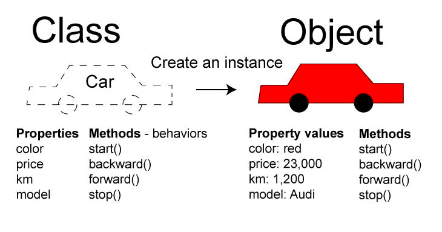
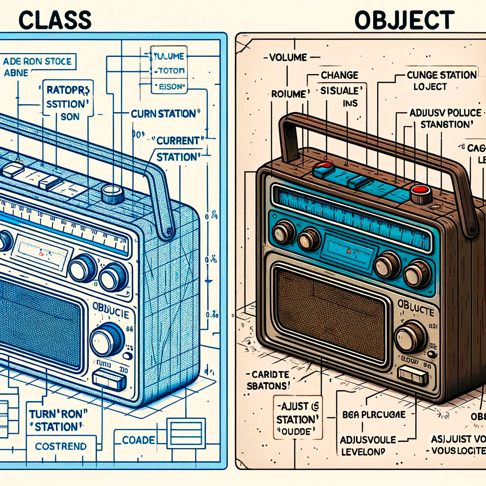
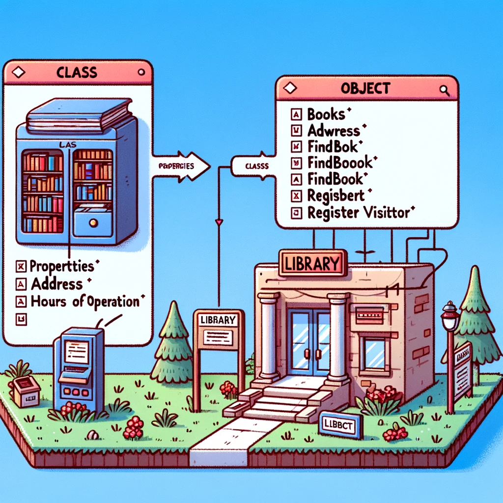

<details style="margin-left: 20px;">
<summary><strong><em> Lesson 16. Введение в Объектно-Ориентированное Программирование: (нажмите на треугольник, чтобы развернуть текст)</em></strong></summary>

# Lesson 16. Введение в Объектно-Ориентированное Программирование (ООП)

## Введение в Объектно-Ориентированное Программирование (ООП) (10 минут)

#### Обзор: Что такое ООП
- **Определение ООП:**
    - Объектно-ориентированное программирование (ООП) - это парадигма программирования, которая использует "объекты" – структуры данных, состоящие из полей (атрибутов) и методов (функций), – для проектирования приложений и программ.
- **Роль ООП в Разработке:**
    - ООП позволяет программистам структурировать и организовывать код более эффективно, делая его более гибким, масштабируемым и легким для поддержки.
    - Подход, ориентированный на моделирование реального мира, облегчает понимание и управление сложными системами.

#### Краткий Исторический Контекст ООП
- **Развитие ООП:**
    - ООП начало развиваться в 1960-х годах с появлением языка программирования Simula, который ввел концепцию классов и объектов.
    - В 1970-х и 1980-х годах ООП продолжило развиваться с языками, такими как Smalltalk, который полностью основан на объектно-ориентированных принципах, и C++, который добавил объектно-ориентированные возможности к языку C.
- **Современное ООП:**
    - В настоящее время многие популярные языки программирования, такие как Java, C#, Python, и Ruby, поддерживают ООП.
    - ООП оказало значительное влияние на разработку программного обеспечения, в том числе на проектирование архитектуры программ, разработку фреймворков и проектирование пользовательских интерфейсов.

<details style="margin-left: 20px;">
<summary><strong><em> Бытовая аналогия: (нажмите на треугольник, чтобы развернуть текст)</em></strong></summary>

### Аналогия с Рестораном для Понимания Объектов в Программировании

#### Простой Java-Код (Рецепты в Ресторане):
- **Рецепты:** Как рецепты в ресторане дают точные инструкции по приготовлению блюд, простой Java-код представляет собой последовательность команд без "состояния". Он подобен четким указаниям, например, "добавить 100 грамм сахара".
- **Характеристики:** Такой код выполняется точно по инструкции, не сохраняет информацию о предыдущих действиях и не имеет внутреннего состояния.

#### Объекты в Программировании (Повара в Ресторане):
- **Повара:** Повара в ресторане, каждый со своими инструментами и методами приготовления, аналогичны объектам в ООП. Каждый повар (объект) может использовать общие рецепты (общий код), но при этом иметь свой стиль приготовления и ингредиенты (индивидуальное состояние и поведение).
- **Взаимодействие и Состояние:** Повара могут взаимодействовать друг с другом и "запоминать" разные состояния (например, количество доступных ингредиентов), что сравнимо с объектами, хранящими информацию в своих полях и взаимодействующими с помощью методов.

#### Вывод:
- **Простой код** в Java подобен **рецептам** – это фиксированные инструкции без внутреннего состояния.
- **Объекты** в программировании похожи на **поваров** в ресторане – они имеют свои уникальные характеристики и способы взаимодействия, обеспечивая гибкость и модульность в программе.

</details>

<details style="margin-left: 20px;">
<summary><strong><em> Разбор отдельных примеров: (нажмите на треугольник, чтобы развернуть текст)</em></strong></summary>

### Аналогии для Понимания Объектов в Программировании

<details style="margin-left: 20px;">
<summary><strong><em> Объект 1: Автомобиль: (нажмите на треугольник, чтобы развернуть текст)</em></strong></summary>

#### Объект 1: Автомобиль

- **Поля (Атрибуты):**
    - `цвет`: Определяет цвет автомобиля.
    - `марка`: Бренд или производитель автомобиля.
    - `текущаяСкорость`: Текущая скорость автомобиля.
    - `максимальнаяСкорость`: Максимально возможная скорость автомобиля.

- **Методы (Поведение):**
    - `ускорить(скорость)`: Увеличивает текущую скорость автомобиля.
    - `замедлить(скорость)`: Уменьшает текущую скорость автомобиля.
    - `показатьИнформацию()`: Отображает информацию об автомобиле.

<details style="margin-left: 20px;">
<summary><strong><em> Пример реализации в коде объекта автомобиль: (нажмите на треугольник, чтобы развернуть текст)</em></strong></summary>



```java
public class Automobile {
    private String color;
    private String brand;
    private int currentSpeed;
    private int maxSpeed;

    // Конструктор класса Automobile
    public Automobile(String color, String brand, int maxSpeed) {
        this.color = color;
        this.brand = brand;
        this.maxSpeed = maxSpeed;
        this.currentSpeed = 0; // Начальная скорость равна 0
    }

    // Метод для ускорения автомобиля
    public void accelerate(int speed) {
        currentSpeed += speed;
        if (currentSpeed > maxSpeed) {
            currentSpeed = maxSpeed;
        }
    }

    // Метод для замедления автомобиля
    public void decelerate(int speed) {
        currentSpeed -= speed;
        if (currentSpeed < 0) {
            currentSpeed = 0;
        }
    }

    // Метод для отображения информации об автомобиле
    public void showInfo() {
        System.out.println("Автомобиль марки " + brand + ", цвет: " + color + ", текущая скорость: " + currentSpeed + " км/ч, максимальная скорость: " + maxSpeed + " км/ч.");
    }

    // Геттеры и сеттеры
    public String getColor() {
        return color;
    }

    public void setColor(String color) {
        this.color = color;
    }

    public String getBrand() {
        return brand;
    }

    public void setBrand(String brand) {
        this.brand = brand;
    }

    public int getCurrentSpeed() {
        return currentSpeed;
    }

    public void setCurrentSpeed(int currentSpeed) {
        this.currentSpeed = currentSpeed;
    }

    public int getMaxSpeed() {
        return maxSpeed;
    }

    public void setMaxSpeed(int maxSpeed) {
        this.maxSpeed = maxSpeed;
    }
}

```
</details>
</details>

<details style="margin-left: 20px;">
<summary><strong><em> Объект 2: Радио: (нажмите на треугольник, чтобы развернуть текст)</em></strong></summary>

#### Объект 2: Радио

- **Поля (Атрибуты):**
    - `громкость`: Уровень громкости радио.
    - `текущаяСтанция`: Играющая в данный момент радиостанция.
    - `включено`: Состояние радио (включено/выключено).

- **Методы (Поведение):**
    - `включить()`: Включает радио.
    - `выключить()`: Выключает радио.
    - `сменитьСтанцию(станция)`: Переключает на другую радиостанцию.
    - `регулироватьГромкость(уровень)`: Изменяет уровень громкости радио.

<details style="margin-left: 20px;">
<summary><strong><em> Пример реализации в коде объекта Радио: (нажмите на треугольник, чтобы развернуть текст)</em></strong></summary>



```java
public class Radio {
    private int volume;
    private String currentStation;
    private boolean isOn;

    // Конструктор класса Radio
    public Radio() {
        this.volume = 0; // Начальный уровень громкости
        this.currentStation = "Не выбрана"; // Начальная радиостанция
        this.isOn = false; // Радио изначально выключено
    }

    // Метод для включения радио
    public void turnOn() {
        isOn = true;
        System.out.println("Радио включено.");
    }

    // Метод для выключения радио
    public void turnOff() {
        isOn = false;
        System.out.println("Радио выключено.");
    }

    // Метод для смены радиостанции
    public void changeStation(String station) {
        if (isOn) {
            currentStation = station;
            System.out.println("Переключено на станцию: " + station);
        } else {
            System.out.println("Радио выключено. Смена станции невозможна.");
        }
    }

    // Метод для регулировки громкости
    public void adjustVolume(int level) {
        if (isOn) {
            volume = level;
            System.out.println("Громкость установлена на уровень: " + level);
        } else {
            System.out.println("Радио выключено. Регулировка громкости невозможна.");
        }
    }

    // Геттеры и сеттеры
    public int getVolume() {
        return volume;
    }

    public void setVolume(int volume) {
        this.volume = volume;
    }

    public String getCurrentStation() {
        return currentStation;
    }

    public void setCurrentStation(String currentStation) {
        this.currentStation = currentStation;
    }

    public boolean isOn() {
        return isOn;
    }

    public void setOn(boolean isOn) {
        this.isOn = isOn;
    }
}
```
</details>
</details>

<details style="margin-left: 20px;">
<summary><strong><em> Объект 3: Кофеварка: (нажмите на треугольник, чтобы развернуть текст)</em></strong></summary>

#### Объект 3: Кофеварка
- **Поля (Атрибуты):**
    - `уровеньВоды`: Количество воды в кофеварке.
    - `температура`: Температура нагрева воды.
    - `типКофе`: Тип кофе, который используется (например, эспрессо, американо).

- **Методы (Поведение):**
    - `сделатьКофе()`: Готовит кофе согласно заданным параметрам.
    - `очистить()`: Очищает кофеварку.
    - `заполнитьВодой(количество)`: Добавляет воду в кофеварку.


<details style="margin-left: 20px;">
<summary><strong><em> Пример реализации в коде объекта Кофеварка: (нажмите на треугольник, чтобы развернуть текст)</em></strong></summary>

```java
public class CoffeeMaker {
    private int waterLevel;
    private int temperature;
    private String coffeeType;

    // Конструктор класса CoffeeMaker
    public CoffeeMaker() {
        this.waterLevel = 0; // Начальный уровень воды
        this.temperature = 90; // Начальная температура для кофе
        this.coffeeType = "не выбран"; // Начальный тип кофе
    }

    // Метод для приготовления кофе
    public void makeCoffee() {
        if (waterLevel > 0 && !coffeeType.equals("не выбран")) {
            System.out.println("Готовлю " + coffeeType + " при температуре " + temperature + "°C.");
            // Предположим, что приготовление кофе уменьшает уровень воды
            waterLevel -= 50;
            if (waterLevel < 0) {
                waterLevel = 0;
            }
            System.out.println("Кофе готов! Осталось воды: " + waterLevel + " мл.");
        } else {
            System.out.println("Пожалуйста, добавьте воду и выберите тип кофе.");
        }
    }

    // Метод для очистки кофеварки
    public void clean() {
        System.out.println("Кофеварка очищена.");
    }

    // Метод для добавления воды в кофеварку
    public void fillWater(int amount) {
        waterLevel += amount;
        System.out.println("Добавлено " + amount + " мл воды. Текущий уровень воды: " + waterLevel + " мл.");
    }

    // Геттеры и сеттеры
    public int getWaterLevel() {
        return waterLevel;
    }

    public void setWaterLevel(int waterLevel) {
        this.waterLevel = waterLevel;
    }

    public int getTemperature() {
        return temperature;
    }

    public void setTemperature(int temperature) {
        this.temperature = temperature;
    }

    public String getCoffeeType() {
        return coffeeType;
    }

    public void setCoffeeType(String coffeeType) {
        this.coffeeType = coffeeType;
    }
}
```
</details>
</details>

<details style="margin-left: 20px;">
<summary><strong><em> Объект 4: Умные Часы: (нажмите на треугольник, чтобы развернуть текст)</em></strong></summary>

#### Объект 4: Умные Часы
- **Поля (Атрибуты):**
    - `время`: Текущее время.
    - `шаги`: Количество пройденных шагов.
    - `уведомления`: Список активных уведомлений.

- **Методы (Поведение):**
    - `показатьВремя()`: Отображает текущее время.
    - `отследитьШаги()`: Обновляет и отображает количество шагов.
    - `получитьУведомление(сообщение)`: Добавляет новое уведомление в список.

<details style="margin-left: 20px;">
<summary><strong><em> Пример реализации в коде объекта Кофеварка: (нажмите на треугольник, чтобы развернуть текст)</em></strong></summary>

```java
import java.util.ArrayList;
import java.util.List;

public class SmartWatch {
    private String currentTime;
    private int steps;
    private List<String> notifications;

    // Конструктор класса SmartWatch
    public SmartWatch() {
        this.currentTime = "12:00"; // Начальное время
        this.steps = 0; // Начальное количество шагов
        this.notifications = new ArrayList<>(); // Инициализация списка уведомлений
    }

    // Метод для отображения текущего времени
    public void showTime() {
        System.out.println("Текущее время: " + currentTime);
    }

    // Метод для отслеживания шагов
    public void trackSteps() {
        // Предполагаем, что метод каким-то образом обновляет количество шагов
        steps += 100; // Пример добавления шагов
        System.out.println("Количество пройденных шагов: " + steps);
    }

    // Метод для получения уведомления
    public void receiveNotification(String message) {
        notifications.add(message);
        System.out.println("Новое уведомление: " + message);
    }

    // Геттеры и сеттеры
    public String getCurrentTime() {
        return currentTime;
    }

    public void setCurrentTime(String currentTime) {
        this.currentTime = currentTime;
    }

    public int getSteps() {
        return steps;
    }

    public void setSteps(int steps) {
        this.steps = steps;
    }

    public List<String> getNotifications() {
        return notifications;
    }

    // Дополнительный метод для отображения всех уведомлений
    public void showNotifications() {
        if (notifications.isEmpty()) {
            System.out.println("Нет уведомлений.");
        } else {
            System.out.println("Уведомления:");
            for (String notification : notifications) {
                System.out.println("- " + notification);
            }
        }
    }
}
```
</details>
</details>

<details style="margin-left: 20px;">
<summary><strong><em> Объект 5: Библиотека: (нажмите на треугольник, чтобы развернуть текст)</em></strong></summary>

#### Объект 5: Библиотека
- **Поля (Атрибуты):**
    - `книги`: Список книг в библиотеке.
    - `адрес`: Адрес библиотеки.
    - `часыРаботы`: Часы работы библиотеки.

- **Методы (Поведение):**
    - `добавитьКнигу(книга)`: Добавляет новую книгу в библиотеку.
    - `найтиКнигу(название)`: Ищет книгу по названию.
    - `зарегистрироватьПосетителя(посетитель)`: Регистрирует нового посетителя в библиотеке.

<details style="margin-left: 20px;">
<summary><strong><em> Пример реализации в коде объекта Библиотека: (нажмите на треугольник, чтобы развернуть текст)</em></strong></summary>



```java
import java.util.ArrayList;
import java.util.HashMap;
import java.util.List;
import java.util.Map;

public class Library {
    private List<String> books;
    private String address;
    private String hoursOfWork;
    private Map<String, Boolean> visitors;

    // Конструктор класса Library
    public Library(String address, String hoursOfWork) {
        this.books = new ArrayList<>();
        this.address = address;
        this.hoursOfWork = hoursOfWork;
        this.visitors = new HashMap<>();
    }

    // Метод для добавления новой книги в библиотеку
    public void addBook(String book) {
        books.add(book);
        System.out.println("Книга \"" + book + "\" добавлена в библиотеку.");
    }

    // Метод для поиска книги по названию
    public boolean findBook(String title) {
        for (String book : books) {
            if (book.equalsIgnoreCase(title)) {
                System.out.println("Книга найдена: " + book);
                return true;
            }
        }
        System.out.println("Книга \"" + title + "\" не найдена.");
        return false;
    }

    // Метод для регистрации нового посетителя в библиотеке
    public void registerVisitor(String visitorName) {
        visitors.put(visitorName, true);
        System.out.println("Посетитель " + visitorName + " зарегистрирован в библиотеке.");
    }

    // Геттеры и сеттеры
    public List<String> getBooks() {
        return books;
    }

    public String getAddress() {
        return address;
    }

    public void setAddress(String address) {
        this.address = address;
    }

    public String getHoursOfWork() {
        return hoursOfWork;
    }

    public void setHoursOfWork(String hoursOfWork) {
        this.hoursOfWork = hoursOfWork;
    }

    public Map<String, Boolean> getVisitors() {
        return visitors;
    }
}

```
</details>
</details>
</details>
</details>

---------------------