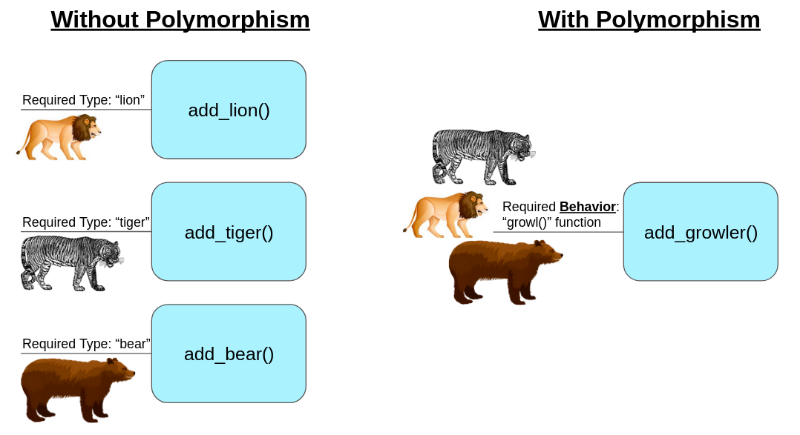

<details style="margin-left: 20px;">
<summary><strong><em> Lesson 16. Введение в Объектно-Ориентированное Программирование: (нажмите на треугольник, чтобы развернуть текст)</em></strong></summary>

# Lesson 16. Введение в Объектно-Ориентированное Программирование (ООП)

## Введение в Объектно-Ориентированное Программирование (ООП) (10 минут)

#### Обзор: Что такое ООП
- **Определение ООП:**
    - Объектно-ориентированное программирование (ООП) - это парадигма программирования, которая использует "объекты" – структуры данных, состоящие из полей (атрибутов) и методов (функций), – для проектирования приложений и программ.
- **Роль ООП в Разработке:**
    - ООП позволяет программистам структурировать и организовывать код более эффективно, делая его более гибким, масштабируемым и легким для поддержки.
    - Подход, ориентированный на моделирование реального мира, облегчает понимание и управление сложными системами.

#### Краткий Исторический Контекст ООП
- **Развитие ООП:**
    - ООП начало развиваться в 1960-х годах с появлением языка программирования Simula, который ввел концепцию классов и объектов.
    - В 1970-х и 1980-х годах ООП продолжило развиваться с языками, такими как Smalltalk, который полностью основан на объектно-ориентированных принципах, и C++, который добавил объектно-ориентированные возможности к языку C.
- **Современное ООП:**
    - В настоящее время многие популярные языки программирования, такие как Java, C#, Python, и Ruby, поддерживают ООП.
    - ООП оказало значительное влияние на разработку программного обеспечения, в том числе на проектирование архитектуры программ, разработку фреймворков и проектирование пользовательских интерфейсов.

<details style="margin-left: 20px;">
<summary><strong><em> Бытовая аналогия: (нажмите на треугольник, чтобы развернуть текст)</em></strong></summary>

### Аналогия с Рестораном для Понимания Объектов в Программировании

#### Простой Java-Код (Рецепты в Ресторане):
- **Рецепты:** Как рецепты в ресторане дают точные инструкции по приготовлению блюд, простой Java-код представляет собой последовательность команд без "состояния". Он подобен четким указаниям, например, "добавить 100 грамм сахара".
- **Характеристики:** Такой код выполняется точно по инструкции, не сохраняет информацию о предыдущих действиях и не имеет внутреннего состояния.

#### Объекты в Программировании (Повара в Ресторане):
- **Повара:** Повара в ресторане, каждый со своими инструментами и методами приготовления, аналогичны объектам в ООП. Каждый повар (объект) может использовать общие рецепты (общий код), но при этом иметь свой стиль приготовления и ингредиенты (индивидуальное состояние и поведение).
- **Взаимодействие и Состояние:** Повара могут взаимодействовать друг с другом и "запоминать" разные состояния (например, количество доступных ингредиентов), что сравнимо с объектами, хранящими информацию в своих полях и взаимодействующими с помощью методов.

#### Вывод:
- **Простой код** в Java подобен **рецептам** – это фиксированные инструкции без внутреннего состояния.
- **Объекты** в программировании похожи на **поваров** в ресторане – они имеют свои уникальные характеристики и способы взаимодействия, обеспечивая гибкость и модульность в программе.

</details>

<details style="margin-left: 20px;">
<summary><strong><em> Разбор отдельных примеров: (нажмите на треугольник, чтобы развернуть текст)</em></strong></summary>

### Аналогии для Понимания Объектов в Программировании

<details style="margin-left: 20px;">
<summary><strong><em> Объект 1: Автомобиль: (нажмите на треугольник, чтобы развернуть текст)</em></strong></summary>

#### Объект 1: Автомобиль

- **Поля (Атрибуты):**
    - `цвет`: Определяет цвет автомобиля.
    - `марка`: Бренд или производитель автомобиля.
    - `текущаяСкорость`: Текущая скорость автомобиля.
    - `максимальнаяСкорость`: Максимально возможная скорость автомобиля.

- **Методы (Поведение):**
    - `ускорить(скорость)`: Увеличивает текущую скорость автомобиля.
    - `замедлить(скорость)`: Уменьшает текущую скорость автомобиля.
    - `показатьИнформацию()`: Отображает информацию об автомобиле.

<details style="margin-left: 20px;">
<summary><strong><em> Пример реализации в коде объекта автомобиль: (нажмите на треугольник, чтобы развернуть текст)</em></strong></summary>


```java
public class Automobile {
    private String color;
    private String brand;
    private int currentSpeed;
    private int maxSpeed;

    // Конструктор класса Automobile
    public Automobile(String color, String brand, int maxSpeed) {
        this.color = color;
        this.brand = brand;
        this.maxSpeed = maxSpeed;
        this.currentSpeed = 0; // Начальная скорость равна 0
    }

    // Метод для ускорения автомобиля
    public void accelerate(int speed) {
        currentSpeed += speed;
        if (currentSpeed > maxSpeed) {
            currentSpeed = maxSpeed;
        }
    }

    // Метод для замедления автомобиля
    public void decelerate(int speed) {
        currentSpeed -= speed;
        if (currentSpeed < 0) {
            currentSpeed = 0;
        }
    }

    // Метод для отображения информации об автомобиле
    public void showInfo() {
        System.out.println("Автомобиль марки " + brand + ", цвет: " + color + ", текущая скорость: " + currentSpeed + " км/ч, максимальная скорость: " + maxSpeed + " км/ч.");
    }

    // Геттеры и сеттеры
    public String getColor() {
        return color;
    }

    public void setColor(String color) {
        this.color = color;
    }

    public String getBrand() {
        return brand;
    }

    public void setBrand(String brand) {
        this.brand = brand;
    }

    public int getCurrentSpeed() {
        return currentSpeed;
    }

    public void setCurrentSpeed(int currentSpeed) {
        this.currentSpeed = currentSpeed;
    }

    public int getMaxSpeed() {
        return maxSpeed;
    }

    public void setMaxSpeed(int maxSpeed) {
        this.maxSpeed = maxSpeed;
    }
}

```
</details>
</details>

<details style="margin-left: 20px;">
<summary><strong><em> Объект 2: Радио: (нажмите на треугольник, чтобы развернуть текст)</em></strong></summary>

#### Объект 2: Радио

- **Поля (Атрибуты):**
    - `громкость`: Уровень громкости радио.
    - `текущаяСтанция`: Играющая в данный момент радиостанция.
    - `включено`: Состояние радио (включено/выключено).

- **Методы (Поведение):**
    - `включить()`: Включает радио.
    - `выключить()`: Выключает радио.
    - `сменитьСтанцию(станция)`: Переключает на другую радиостанцию.
    - `регулироватьГромкость(уровень)`: Изменяет уровень громкости радио.

<details style="margin-left: 20px;">
<summary><strong><em> Пример реализации в коде объекта Радио: (нажмите на треугольник, чтобы развернуть текст)</em></strong></summary>


```java
public class Radio {
    private int volume;
    private String currentStation;
    private boolean isOn;

    // Конструктор класса Radio
    public Radio() {
        this.volume = 0; // Начальный уровень громкости
        this.currentStation = "Не выбрана"; // Начальная радиостанция
        this.isOn = false; // Радио изначально выключено
    }

    // Метод для включения радио
    public void turnOn() {
        isOn = true;
        System.out.println("Радио включено.");
    }

    // Метод для выключения радио
    public void turnOff() {
        isOn = false;
        System.out.println("Радио выключено.");
    }

    // Метод для смены радиостанции
    public void changeStation(String station) {
        if (isOn) {
            currentStation = station;
            System.out.println("Переключено на станцию: " + station);
        } else {
            System.out.println("Радио выключено. Смена станции невозможна.");
        }
    }

    // Метод для регулировки громкости
    public void adjustVolume(int level) {
        if (isOn) {
            volume = level;
            System.out.println("Громкость установлена на уровень: " + level);
        } else {
            System.out.println("Радио выключено. Регулировка громкости невозможна.");
        }
    }

    // Геттеры и сеттеры
    public int getVolume() {
        return volume;
    }

    public void setVolume(int volume) {
        this.volume = volume;
    }

    public String getCurrentStation() {
        return currentStation;
    }

    public void setCurrentStation(String currentStation) {
        this.currentStation = currentStation;
    }

    public boolean isOn() {
        return isOn;
    }

    public void setOn(boolean isOn) {
        this.isOn = isOn;
    }
}
```
</details>
</details>

<details style="margin-left: 20px;">
<summary><strong><em> Объект 3: Кофеварка: (нажмите на треугольник, чтобы развернуть текст)</em></strong></summary>

#### Объект 3: Кофеварка
- **Поля (Атрибуты):**
    - `уровеньВоды`: Количество воды в кофеварке.
    - `температура`: Температура нагрева воды.
    - `типКофе`: Тип кофе, который используется (например, эспрессо, американо).

- **Методы (Поведение):**
    - `сделатьКофе()`: Готовит кофе согласно заданным параметрам.
    - `очистить()`: Очищает кофеварку.
    - `заполнитьВодой(количество)`: Добавляет воду в кофеварку.


<details style="margin-left: 20px;">
<summary><strong><em> Пример реализации в коде объекта Кофеварка: (нажмите на треугольник, чтобы развернуть текст)</em></strong></summary>

```java
public class CoffeeMaker {
    private int waterLevel;
    private int temperature;
    private String coffeeType;

    // Конструктор класса CoffeeMaker
    public CoffeeMaker() {
        this.waterLevel = 0; // Начальный уровень воды
        this.temperature = 90; // Начальная температура для кофе
        this.coffeeType = "не выбран"; // Начальный тип кофе
    }

    // Метод для приготовления кофе
    public void makeCoffee() {
        if (waterLevel > 0 && !coffeeType.equals("не выбран")) {
            System.out.println("Готовлю " + coffeeType + " при температуре " + temperature + "°C.");
            // Предположим, что приготовление кофе уменьшает уровень воды
            waterLevel -= 50;
            if (waterLevel < 0) {
                waterLevel = 0;
            }
            System.out.println("Кофе готов! Осталось воды: " + waterLevel + " мл.");
        } else {
            System.out.println("Пожалуйста, добавьте воду и выберите тип кофе.");
        }
    }

    // Метод для очистки кофеварки
    public void clean() {
        System.out.println("Кофеварка очищена.");
    }

    // Метод для добавления воды в кофеварку
    public void fillWater(int amount) {
        waterLevel += amount;
        System.out.println("Добавлено " + amount + " мл воды. Текущий уровень воды: " + waterLevel + " мл.");
    }

    // Геттеры и сеттеры
    public int getWaterLevel() {
        return waterLevel;
    }

    public void setWaterLevel(int waterLevel) {
        this.waterLevel = waterLevel;
    }

    public int getTemperature() {
        return temperature;
    }

    public void setTemperature(int temperature) {
        this.temperature = temperature;
    }

    public String getCoffeeType() {
        return coffeeType;
    }

    public void setCoffeeType(String coffeeType) {
        this.coffeeType = coffeeType;
    }
}
```
</details>
</details>

<details style="margin-left: 20px;">
<summary><strong><em> Объект 4: Умные Часы: (нажмите на треугольник, чтобы развернуть текст)</em></strong></summary>

#### Объект 4: Умные Часы
- **Поля (Атрибуты):**
    - `время`: Текущее время.
    - `шаги`: Количество пройденных шагов.
    - `уведомления`: Список активных уведомлений.

- **Методы (Поведение):**
    - `показатьВремя()`: Отображает текущее время.
    - `отследитьШаги()`: Обновляет и отображает количество шагов.
    - `получитьУведомление(сообщение)`: Добавляет новое уведомление в список.

<details style="margin-left: 20px;">
<summary><strong><em> Пример реализации в коде объекта Кофеварка: (нажмите на треугольник, чтобы развернуть текст)</em></strong></summary>

```java
import java.util.ArrayList;
import java.util.List;

public class SmartWatch {
    private String currentTime;
    private int steps;
    private List<String> notifications;

    // Конструктор класса SmartWatch
    public SmartWatch() {
        this.currentTime = "12:00"; // Начальное время
        this.steps = 0; // Начальное количество шагов
        this.notifications = new ArrayList<>(); // Инициализация списка уведомлений
    }

    // Метод для отображения текущего времени
    public void showTime() {
        System.out.println("Текущее время: " + currentTime);
    }

    // Метод для отслеживания шагов
    public void trackSteps() {
        // Предполагаем, что метод каким-то образом обновляет количество шагов
        steps += 100; // Пример добавления шагов
        System.out.println("Количество пройденных шагов: " + steps);
    }

    // Метод для получения уведомления
    public void receiveNotification(String message) {
        notifications.add(message);
        System.out.println("Новое уведомление: " + message);
    }

    // Геттеры и сеттеры
    public String getCurrentTime() {
        return currentTime;
    }

    public void setCurrentTime(String currentTime) {
        this.currentTime = currentTime;
    }

    public int getSteps() {
        return steps;
    }

    public void setSteps(int steps) {
        this.steps = steps;
    }

    public List<String> getNotifications() {
        return notifications;
    }

    // Дополнительный метод для отображения всех уведомлений
    public void showNotifications() {
        if (notifications.isEmpty()) {
            System.out.println("Нет уведомлений.");
        } else {
            System.out.println("Уведомления:");
            for (String notification : notifications) {
                System.out.println("- " + notification);
            }
        }
    }
}
```
</details>
</details>

<details style="margin-left: 20px;">
<summary><strong><em> Объект 5: Библиотека: (нажмите на треугольник, чтобы развернуть текст)</em></strong></summary>

#### Объект 5: Библиотека
- **Поля (Атрибуты):**
    - `книги`: Список книг в библиотеке.
    - `адрес`: Адрес библиотеки.
    - `часыРаботы`: Часы работы библиотеки.

- **Методы (Поведение):**
    - `добавитьКнигу(книга)`: Добавляет новую книгу в библиотеку.
    - `найтиКнигу(название)`: Ищет книгу по названию.
    - `зарегистрироватьПосетителя(посетитель)`: Регистрирует нового посетителя в библиотеке.

<details style="margin-left: 20px;">
<summary><strong><em> Пример реализации в коде объекта Библиотека: (нажмите на треугольник, чтобы развернуть текст)</em></strong></summary>


```java
import java.util.ArrayList;
import java.util.HashMap;
import java.util.List;
import java.util.Map;

public class Library {
    private List<String> books;
    private String address;
    private String hoursOfWork;
    private Map<String, Boolean> visitors;

    // Конструктор класса Library
    public Library(String address, String hoursOfWork) {
        this.books = new ArrayList<>();
        this.address = address;
        this.hoursOfWork = hoursOfWork;
        this.visitors = new HashMap<>();
    }

    // Метод для добавления новой книги в библиотеку
    public void addBook(String book) {
        books.add(book);
        System.out.println("Книга \"" + book + "\" добавлена в библиотеку.");
    }

    // Метод для поиска книги по названию
    public boolean findBook(String title) {
        for (String book : books) {
            if (book.equalsIgnoreCase(title)) {
                System.out.println("Книга найдена: " + book);
                return true;
            }
        }
        System.out.println("Книга \"" + title + "\" не найдена.");
        return false;
    }

    // Метод для регистрации нового посетителя в библиотеке
    public void registerVisitor(String visitorName) {
        visitors.put(visitorName, true);
        System.out.println("Посетитель " + visitorName + " зарегистрирован в библиотеке.");
    }

    // Геттеры и сеттеры
    public List<String> getBooks() {
        return books;
    }

    public String getAddress() {
        return address;
    }

    public void setAddress(String address) {
        this.address = address;
    }

    public String getHoursOfWork() {
        return hoursOfWork;
    }

    public void setHoursOfWork(String hoursOfWork) {
        this.hoursOfWork = hoursOfWork;
    }

    public Map<String, Boolean> getVisitors() {
        return visitors;
    }
}

```
</details>
</details>
</details>
</details>

---------------------


<details style="margin-left: 20px;">
<summary><strong><em> Lesson 17. ООП. Принцип "инкапсуляция". Модификаторы доступа, геттеры и сеттеры: (нажмите на треугольник, чтобы развернуть текст)</em></strong></summary>

# Lesson 17

## Введение

### Краткое напоминание о предыдущем уроке (объекты, классы, конструкторы)
На предыдущем уроке мы изучали основные концепции объектно-ориентированного программирования на примере Java:
- **Объекты**: Мы узнали, что объекты - это экземпляры классов, обладающие состоянием (свойствами) и поведением (методами).
- **Классы**: Классы являются шаблонами для создания объектов, определяющими их структуру и поведение.
- **Конструкторы**: Мы рассмотрели, как конструкторы используются для инициализации новых объектов, устанавливая начальные значения для полей объекта.

### Объяснение целей сегодняшнего урока
Сегодня мы продолжим изучение объектно-ориентированного программирования в Java, сосредоточив внимание на следующих темах:
1. **Модификаторы доступа**: Узнаем, как они определяют область видимости и доступ к членам класса (полям, методам).
2. **Статические и нестатические поля и методы**: Поймем разницу между статическими (принадлежащими классу) и нестатическими (принадлежащими объектам) членами.
3. **Геттеры и Сеттеры**: Научимся использовать эти методы для доступа и обновления значений полей объекта, соблюдая принципы инкапсуляции.

Цель сегодняшнего урока - углубить понимание этих ключевых аспектов ООП, что позволит создавать более эффективный и безопасный код на Java.


## 2. Модификаторы доступа

### Определение модификаторов доступа
Модификаторы доступа в Java - это ключевые слова, которые устанавливают уровень доступа к классам, методам, конструкторам и переменным. Они определяют, откуда может быть доступен член класса (метод или переменная) - из этого класса, пакета, подкласса или вообще из любого места.

### Примеры: `public`, `private`, `protected`, `package-private`
- **`public`**: Этот модификатор позволяет доступ к члену класса из любого другого класса в программе. Нет ограничений на доступ.
- **`private`**: Противоположность `public`. Доступ к члену класса возможен только внутри самого класса.
- **`protected`**: Доступ к члену класса разрешён из любого класса в том же пакете, а также из подклассов, даже если они в других пакетах.
- **`package-private`** (без модификатора): Если модификатор доступа не указан, то по умолчанию используется `package-private`. Это означает, что доступ возможен только внутри того же пакета.

### Практические примеры использования в классах и методах
Давайте рассмотрим пример класса с разными модификаторами доступа:

```java
public class ExampleClass {
    public int publicVar = 10;   // Доступно везде
    private int privateVar = 20; // Доступно только в ExampleClass
    protected int protectedVar = 30; // Доступно в подклассах и в пакете
    int packagePrivateVar = 40;  // Доступно в пакете

    public void publicMethod() {
        // метод доступен везде
    }

    private void privateMethod() {
        // метод доступен только в ExampleClass
    }

    protected void protectedMethod() {
        // метод доступен в подклассах и в пакете
    }

    void packagePrivateMethod() {
        // метод доступен в пакете
    }
}
```

<details style="margin-left: 20px;">
<summary><strong><em> Бытовая аналогия: (нажмите на треугольник, чтобы развернуть текст)</em></strong></summary>

## Аналогия Модификаторов Доступа

Модификаторы доступа в Java можно сравнить с доступом к разным пространствам в жилом доме:

### 1. `public` (Общедоступный)
- **Аналогия**: Как городская площадь или общественный парк.
- **Описание**: Доступен каждому, кто желает воспользоваться пространством или предметами.

### 2. `private` (Частный)
- **Аналогия**: Как ваша личная спальня в доме.
- **Описание**: Доступ ограничен исключительно владельцем или очень ограниченным кругом лиц.

### 3. `protected` (Защищённый)
- **Аналогия**: Как гостиная в семейном доме.
- **Описание**: Доступно членам семьи (аналог подклассов) и гостям в доме (тот же пакет), но недоступно для посторонних.

### 4. `package-private` (Пакетный уровень доступа)
- **Аналогия**: Как элементы в общей кухне коммунальной квартиры.
- **Описание**: Доступно жильцам этой квартиры (классы в том же пакете), но недоступно для жильцов других квартир (других пакетов).

Эта аналогия помогает понять, как различные модификаторы доступа ограничивают или расширяют доступ к классам, методам и переменным в Java.

</details>

<details style="margin-left: 20px;">
<summary><strong><em> Простое Объяснение Модификаторов Доступа в Java: (нажмите на треугольник, чтобы развернуть текст)</em></strong></summary>


## Простое Объяснение Модификаторов Доступа в Java

### `private` (Частный)
- **Цель**: Сохранить важные данные или функции внутри класса, скрытые от всех.
- **Как это работает**: Это как иметь личный дневник, который только вы можете читать и писать в него.
- **Почему это важно**: Чтобы предотвратить случайные изменения или просмотр чувствительных данных другими частями программы.

### `public` (Общедоступный)
- **Цель**: Сделать методы или данные доступными для всех.
- **Как это работает**: Это как общедоступный объявлений на доске, к которому может обратиться любой.
- **Почему это важно**: Чтобы разные части программы могли свободно взаимодействовать с этими элементами.

### `protected` (Защищённый)
- **Цель**: Позволить доступ к данным или функциям только "родственным" классам.
- **Как это работает**: Это как секреты, которыми вы делитесь только с близкими родственниками.
- **Почему это важно**: Чтобы подклассы могли использовать и изменять эти данные, сохраняя контроль над доступом.

### `package-private` (Уровень пакета)
- **Цель**: Ограничить доступ в пределах одного "района" или пакета классов.
- **Как это работает**: Это как закрытый клуб в районе, куда могут зайти только жители этого района.
- **Почему это важно**: Для упорядочивания и защиты данных в рамках одного пакета, не позволяя внешним классам вмешиваться.

Эти модификаторы доступа помогают контролировать, как разные части программы взаимодействуют друг с другом, обеспечивая безопасность и порядок в структуре программы.
</details>


## Статические и Нестатические Поля и Методы в Java

### Определение и различия
- **Статические поля и методы** принадлежат классу в целом, а не отдельному объекту. Они общие для всех экземпляров класса.
- **Нестатические поля и методы** принадлежат конкретному объекту, созданному из класса, и каждый объект имеет свои копии этих полей и методов.

### Примеры статических методов и полей
- **Пример поля**: Счётчик, который отслеживает количество созданных объектов класса.
- **Пример метода**: Метод, который возвращает информацию о классе или выполняет операции, не зависящие от конкретного объекта.

### Примеры нестатических методов и полей
- **Пример поля**: Значение, уникальное для каждого объекта, например, имя пользователя.
- **Пример метода**: Метод, который работает с уникальными данными объекта, например, выводит имя пользователя.

### Практическое применение: когда и как использовать
- **Использование статических полей и методов**:
  - Когда нужна информация или функциональность, общая для всех экземпляров класса.
  - Пример: методы-помощники (utility methods), константы.
- **Использование нестатических полей и методов**:
  - Когда данные или функциональность связаны с конкретным экземпляром класса.
  - Пример: методы, изменяющие состояние объекта, или поля, уникальные для каждого объекта.

<details style="margin-left: 20px;">
<summary><strong><em> Аналогия: (нажмите на треугольник, чтобы развернуть текст)</em></strong></summary>


Представьте класс как школу. Статическое поле – это, например, количество всех учеников в школе, а нестатическое поле –
это имя конкретного ученика. Статический метод может быть что-то вроде "получить общее количество учеников в школе",
тогда как нестатический метод мог бы "вывести имя ученика".

</details>

Выбор между статическим и нестатическим подходом зависит от того, нужна ли функциональность или данные на уровне класса в целом или на уровне конкретных объектов.

<details style="margin-left: 20px;">
<summary><strong><em> Пример кода: (нажмите на треугольник, чтобы развернуть текст)</em></strong></summary>

```java
public class Counter {
    // Статическое поле для отслеживания количества экземпляров класса Counter
    private static int count = 0;

    // Конструктор, увеличивающий счетчик при создании нового экземпляра
    public Counter() {
        count++;
    }

    // Статический метод для получения текущего значения счетчика
    public static int getCount() {
        return count;
    }

    // Пример использования класса Counter
    public static void main(String[] args) {
        Counter c1 = new Counter();
        Counter c2 = new Counter();
        Counter c3 = new Counter();

        // Вывод количества созданных экземпляров класса Counter
        System.out.println("Создано экземпляров Counter: " + Counter.getCount());
    }
}

```

В этом примере:

- `count` является статическим полем, которое считает количество созданных экземпляров класса `Counter`.
- Каждый раз при создании нового объекта класса `Counter`, конструктор увеличивает значение `count`.
- Статический метод `getCount` возвращает текущее значение счетчика.
- В методе `main` мы создаём три экземпляра `Counter` и затем выводим количество созданных экземпляров.
</details>

## Повторение Конструкторов

### Краткое напоминание о конструкторах
Конструкторы в Java - это специальные методы, которые вызываются при создании нового объекта класса. Они обычно используются для инициализации объекта, например, для присвоения начальных значений полям. Конструкторы имеют те же имя, что и класс, и не имеют возвращаемого типа.

### Перегрузка конструкторов
Перегрузка конструкторов означает создание нескольких конструкторов с одинаковым именем, но с разными параметрами. Это позволяет создавать объекты класса с разными начальными данными.

### Примеры с разными типами конструкторов
Приведём пример класса с разными типами конструкторов:

<details style="margin-left: 20px;">
<summary><strong><em> Пример кода: (нажмите на треугольник, чтобы развернуть текст)</em></strong></summary>

```java
public class Book {
    private String title;
    private String author;
    private int year;

    // Конструктор по умолчанию
    public Book() {
        this.title = "Неизвестно";
        this.author = "Неизвестно";
        this.year = 0;
    }

    // Конструктор с одним параметром
    public Book(String title) {
        this.title = title;
        this.author = "Неизвестно";
        this.year = 0;
    }

    // Конструктор с двумя параметрами
    public Book(String title, String author) {
        this.title = title;
        this.author = author;
        this.year = 0;
    }

    // Конструктор с тремя параметрами
    public Book(String title, String author, int year) {
        this.title = title;
        this.author = author;
        this.year = year;
    }

    // Методы доступа (геттеры) для полей класса...
}
```

В этом примере класс `Book` имеет четыре конструктора, каждый из которых принимает разное количество параметров. Это
позволяет создавать объекты Book с различными начальными данными.

Таким образом, перегрузка конструкторов обеспечивает гибкость при создании объектов класса, позволяя инициализировать их
различными способами.
</details>

<details style="margin-left: 20px;">
<summary><strong><em> Бытовая аналогия: (нажмите на треугольник, чтобы развернуть текст)</em></strong></summary>

## Бытовая Аналогия для Конструктора и Перегрузки Конструкторов

### Аналогия для Конструктора

Конструктор в программировании можно сравнить с процессом постройки дома по определённому плану. Как и в постройке дома,
где у вас есть различные параметры (например, количество комнат, цвет стен, наличие гаража), конструктор в классе
определяет, как создаётся объект и какие начальные значения ему присваиваются.

- **Пример**: Представьте, что вы строите дом. Конструктор - это план строительства, который говорит, как дом должен
  быть построен и что в него включено.

### Аналогия для Перегрузки Конструкторов

Перегрузка конструкторов подобна наличию нескольких вариантов планов для постройки домов. Каждый план предлагает разные
опции - один может включать гараж, другой - большой сад, а третий - бассейн. Выбор плана зависит от того, что вы хотите
иметь в своём доме.

- **Пример**: Вы решаете построить дом, и у вас есть несколько планов на выбор:
  - Основной план (конструктор по умолчанию) - строится стандартный дом.
  - План с дополнительными опциями (перегруженный конструктор) - строится дом с дополнительными удобствами, такими как
    гараж или сад.

Каждый "план" (конструктор) позволяет создать "дом" (объект) с различными характеристиками, в зависимости от того, какие
параметры вы выбрали. Это обеспечивает гибкость при создании объектов в программировании.

</details>


## 5. Геттеры и Сеттеры

### Определение геттеров и сеттеров
Геттеры (Getters) и сеттеры (Setters) – это методы в объектно-ориентированном программировании, используемые для доступа и обновления значений полей объекта.

- **Геттеры** - методы, которые возвращают значение поля объекта.
- **Сеттеры** - методы, которые позволяют устанавливать или изменять значение поля объекта.

### Почему и когда использовать геттеры и сеттеры
- **Защита данных**: Геттеры и сеттеры позволяют контролировать, как внешние классы получают доступ к полям объекта, предотвращая неправильное использование или изменение данных.
- **Гибкость**: Можно изменить способ хранения данных, не влияя на классы, которые используют эти данные.
- **Добавление логики**: Можно вставлять дополнительную логику при получении или установке значения, например, проверку допустимости данных.

### Создание геттеров и сеттеров на примерах
Пример класса с геттерами и сеттерами:

```java
public class Person {
    private String name;
    private int age;

    // Конструктор
    public Person(String name, int age) {
        this.name = name;
        this.age = age;
    }

    // Геттер для имени
    public String getName() {
        return name;
    }

    // Сеттер для имени
    public void setName(String name) {
        this.name = name;
    }

    // Геттер для возраста
    public int getAge() {
        return age;
    }

    // Сеттер для возраста
    public void setAge(int age) {
        if (age > 0) {
            this.age = age;
        }
    }
}
```

В этом примере класс `Person` имеет приватные поля `name` и `age`. Геттеры (`getName` и `getAge`) возвращают значения этих полей,
а сеттеры (`setName` и `setAge`) позволяют изменять их, при этом сеттер `setAge` включает проверку допустимости значения.

### Инкапсуляция данных через геттеры и сеттеры
Использование геттеров и сеттеров является ключевым аспектом инкапсуляции в объектно-ориентированном программировании.
Они обеспечивают безопасный доступ к данным объекта, скрывая внутреннюю реализацию и защищая данные от нежелательного
воздействия.

### Почему важно использовать геттеры и сеттеры, а не просто давать доступ к полям

#### 1. Инкапсуляция и Защита данных
- **Скрытие реализации**: Геттеры и сеттеры скрывают внутреннюю реализацию класса. Это означает, что можно изменять внутреннюю структуру класса, не затрагивая те части программы, которые используют этот класс.
- **Контроль доступа**: Предоставляя только геттеры, можно сделать поля класса доступными только для чтения. Аналогично, можно предоставить только сеттеры для полей, которые должны быть доступны только для записи.

#### 2. Валидация данных
- **Проверка вводимых данных**: Сеттеры позволяют вставлять логику проверки данных, гарантируя, что в поле не будет установлено недопустимое значение.
- **Пример**: В сеттере для возраста (`setAge`) можно убедиться, что возраст не отрицателен.

#### 3. Дополнительная логика
- **Добавление дополнительного кода**: В геттерах и сеттерах можно реализовать дополнительную логику, например, логирование, отложенную инициализацию и т.д.
- **Пример**: В геттере можно реализовать логику "ленивой загрузки" (lazy loading), загружая данные при первом обращении.

#### 4. Удобство поддержки и расширения
- **Легкость обновления и поддержки**: Использование геттеров и сеттеров делает код более удобным для поддержки и обновления. Можно легко отслеживать, где и как используются поля класса.
- **Совместимость с фреймворками**: Многие фреймворки Java, такие как Spring или Hibernate, основаны на паттернах с использованием геттеров и сеттеров.

#### 5. Поддержка принципов ООП
- **Соответствие принципам объектно-ориентированного программирования**: Геттеры и сеттеры помогают следовать принципам ООП, таким как инкапсуляция и абстракция, обеспечивая более чистую и организованную структуру кода.

#### 6. Удобство тестирования
- **Облегчение процесса тестирования**: Тестирование классов с инкапсуляцией через геттеры и сеттеры обычно проще, так как можно легко установить и проверить состояние объекта.

Использование геттеров и сеттеров вместо прямого доступа к полям помогает создавать более безопасный, гибкий и легко поддерживаемый код. Это ключевые аспекты качественного программного обеспечения.

<details style="margin-left: 20px;">
<summary><strong><em> Пример кода: (нажмите на треугольник, чтобы развернуть текст)</em></strong></summary>

```java
public class Employee {
    public String name;
    public int age;
    public double salary;

    public Employee(String name, int age, double salary) {
        this.name = name;
        this.age = age;
        this.salary = salary;
    }
}
```

В этом классе `Employee`, поля `name`, `age` и `salary` являются общедоступными (`public`). Это позволяет напрямую изменять эти
поля из внешнего кода, что может привести к следующим проблемам:

### Потенциальные Ошибки
Неправильная Валидация: Данные могут быть изменены без проверки допустимости. Например, возраст может быть установлен в
отрицательное значение, что является недопустимым.

```java
Employee emp = new Employee("John", 30, 5000.0);
emp.age = -5; // Недопустимое значение, но возможно из-за прямого доступа
```

### Неконтролируемое Изменение:
Внешние классы могут изменять состояние объекта `Employee` без его ведома, что может привести
к непредсказуемому поведению программы.

`emp.salary = 1000000; // Значение зарплаты изменено напрямую, что может быть ошибкой`


### Отсутствие Гибкости:
Если потребуется изменить логику работы с данными (например, добавить округление для зарплаты),
придется искать и изменять каждое место в коде, где происходит доступ к этому полю.

```java
// Везде, где изменяется зарплата, нужно будет добавить логику округления
emp.salary = Math.round(4567.89);
```

### Проблемы с Отладкой:
Сложнее отслеживать, где и как меняются данные, так как изменения могут происходить в любой части
программы, что затрудняет отладку и поиск ошибок.

Вывод
Использование геттеров и сеттеров вместо прямого доступа к полям позволяет лучше контролировать данные, обеспечивать их
валидацию, гибкость и удобство в поддержке кода.
</details>

</details>

----------------------

<details style="margin-left: 20px;">
<summary><strong><em> Lesson 18. ООП. Принцип "Наследование": (нажмите на треугольник, чтобы развернуть текст)</em></strong></summary>

# Lesson 18

## 1. Введение в Наследование

### Объяснение Наследования в Контексте ООП

Наследование — это один из основных принципов объектно-ориентированного программирования (ООП). Оно позволяет новому
классу принимать (или "наследовать") свойства и методы существующего класса. Это способствует повторному использованию
кода и установлению иерархии между классами.

В ООП, класс, который наследует свойства, называется производным или дочерним классом, а класс, от которого наследуются
свойства, называется базовым или родительским классом. Наследование дает возможность:

- **Избежать дублирования кода:** Общие свойства и методы родительского класса автоматически доступны в дочерних
  классах.
- **Расширять функциональность:** Дочерние классы могут расширять или изменять наследуемые свойства и методы.
- **Создавать иерархические отношения:** Устанавливает четкую иерархию между классами.

### Примеры Наследования в Реальном Мире

1. **Транспортные средства:** Можно рассмотреть общий класс `Транспортное Средство`, от которого
   наследуются `Автомобиль`, `Велосипед`, `Лодка` и т.д. Каждый из этих классов наследует общие свойства, такие как
   количество колес или метод перемещения, но также имеет уникальные характеристики.

2. **Электронные устройства:** Базовый класс `Электронное Устройство` может включать свойства, такие как источник
   питания и метод включения/выключения. От этого класса можно наследовать более специфические классы, такие
   как `Смартфон`, `Ноутбук` или `Телевизор`, каждый из которых добавляет свои уникальные функции.

3. **Животные:** В биологическом контексте можно рассмотреть класс `Животное` с общими характеристиками, такими как
   способность к передвижению и дыханию. От него могут наследовать классы `Птица`, `Рыба` и `Млекопитающее`, каждый из
   которых расширяет базовый класс своими уникальными свойствами и поведением.

Эти примеры иллюстрируют, как наследование в программировании отражает иерархическую структуру, существующую в реальном
мире, и как оно может быть использовано для создания упорядоченных, легко расширяемых и управляемых кодовых структур.

## 2. Основы Наследования в Java

### Ключевое слово `extends`

В Java, наследование между классами реализуется с помощью ключевого слова `extends`. Когда класс `B` наследует от
класса `A`, это означает, что `B` расширяет (extends) `A`. В этом случае, `A` называется родительским (или
суперклассом), а `B` - дочерним (или подклассом).



### Создание базового (родительского) класса и производного (дочернего) класса

#### Базовый Класс

Базовый класс определяет общие характеристики и поведение, которые будут унаследованы дочерними классами. Например:

```java
public class Vehicle {
    private String name;

    public Vehicle(String name) {
        this.name = name;
    }

    public void move() {
        System.out.println(name + " is moving.");
    }

    // ... дополнительные методы и свойства ...
}
```

#### Дочерний Класс

Дочерний класс наследует свойства и методы базового класса и может добавлять свои уникальные элементы:

```java
public class Car extends Vehicle {
    private int numberOfWheels;

    public Car(String name, int numberOfWheels) {
        super(name); // Вызов конструктора родительского класса
        this.numberOfWheels = numberOfWheels;
    }

    public void honk() {
        System.out.println("Beep beep!");
    }

    // ... дополнительные методы и свойства ...
}

```

### Наследование и повторное использование методов и свойств

Наследование позволяет дочерним классам не только использовать методы и свойства родительского класса, но и расширять
или модифицировать их. Например, в классе `Car` доступен метод `move()` из класса `Vehicle`, а также добавлен уникальный
метод
`honk()`.

Это повторное использование кода уменьшает дублирование и упрощает управление изменениями, так как общие изменения в
родительском классе автоматически распространяются на все дочерние классы.

<details style="margin-left: 20px;">
<summary><strong><em> Пример: (нажмите на треугольник, чтобы развернуть текст)</em></strong></summary>

Представьте, что у нас есть общий класс умных устройств под названием `SmartDevice`. Этот класс включает в себя общие
характеристики и функциональности, которые есть у всех умных устройств, например, возможность подключения к Wi-Fi,
наличие батареи и базовые функции управления питанием.

### Родительский Класс: SmartDevice

```java
public class SmartDevice {
    private boolean isConnectedToWiFi;
    private int batteryLevel;

    public SmartDevice() {
        this.isConnectedToWiFi = false;
        this.batteryLevel = 100;
    }

    public void connectToWiFi() {
        isConnectedToWiFi = true;
        System.out.println("Connected to Wi-Fi.");
    }

    public void disconnectFromWiFi() {
        isConnectedToWiFi = false;
        System.out.println("Disconnected from Wi-Fi.");
    }

    // ... Другие общие методы и свойства ...
}

```

Теперь предположим, что у нас есть два конкретных типа умных устройств: `SmartPhone` и `SmartWatch`. Каждое из этих
устройств наследует общие характеристики от `SmartDevice`, но также добавляет свои специфические функции.

### Дочерний Класс: SmartPhone

```java
public class SmartPhone extends SmartDevice {
    private int cameraResolution;

    public SmartPhone(int cameraResolution) {
        super();
        this.cameraResolution = cameraResolution;
    }

    public void takePhoto() {
        if (cameraResolution > 0) {
            System.out.println("Taking a photo with resolution: " + cameraResolution + " megapixels.");
        }
    }

    // ... Дополнительные уникальные методы и свойства ...
}


```

### Дочерний Класс: SmartWatch

```java
public class SmartWatch extends SmartDevice {
    private boolean hasHeartRateMonitor;

    public SmartWatch(boolean hasHeartRateMonitor) {
        super();
        this.hasHeartRateMonitor = hasHeartRateMonitor;
    }

    public void monitorHeartRate() {
        if (hasHeartRateMonitor) {
            System.out.println("Monitoring heart rate...");
        }
    }

    // ... Дополнительные уникальные методы и свойства ...
}

```

В этом примере `SmartPhone` и `SmartWatch` наследуют общие функции умного устройства, такие как подключение к Wi-Fi и
уровень заряда батареи, но также вводят свои специализированные функции: `SmartPhone` может делать фотографии, а
`SmartWatch` может мониторить частоту сердцебиения.

Этот пример иллюстрирует, как наследование позволяет создать общий фундамент (в данном случае для умных устройств) и на
его базе строить специализированные варианты с добавлением уникальных свойств и методов.

### Демонстрационный Класс: SmartDeviceDemo

```java
public class SmartDeviceDemo {
    public static void main(String[] args) {
        // Создание экземпляра SmartPhone
        SmartPhone myPhone = new SmartPhone(12); // 12 мегапикселей для камеры
        myPhone.connectToWiFi(); // Использование метода из родительского класса
        myPhone.takePhoto(); // Использование уникального метода смартфона

        System.out.println("---");

        // Создание экземпляра SmartWatch
        SmartWatch myWatch = new SmartWatch(true); // Наличие монитора сердечного ритма
        myWatch.connectToWiFi(); // Использование метода из родительского класса
        myWatch.monitorHeartRate(); // Использование уникального метода смарт-часов
    }
}

```

В этом примере `SmartDeviceDemo` иллюстрирует следующее:

Как `SmartPhone` и `SmartWatch` используют общий метод `connectToWiFi()` из родительского класса `SmartDevice`.
Как они также используют свои специфические методы: `takePhoto()` для `SmartPhone` и `monitorHeartRate()`
для `SmartWatch`.
Этот пример показывает, как наследование позволяет дочерним классам сохранять и использовать поведение и свойства
родительского класса, при этом добавляя свои уникальные характеристики и функциональность.
</details>

## 3. Конструкторы и Наследование

### Правила вызова конструкторов в иерархии наследования

В Java, при создании объекта дочернего класса, конструкторы в иерархии наследования вызываются в определенном порядке.
Всегда сначала вызывается конструктор родительского класса, а затем конструктор дочернего класса.

### Использование super() для вызова конструкторов родительского класса

Ключевое слово `super` используется для вызова конструктора родительского класса из дочернего класса. Оно должно быть
первой операцией в конструкторе дочернего класса.

<details style="margin-left: 20px;">
<summary><strong><em> Пример: (нажмите на треугольник, чтобы развернуть текст)</em></strong></summary>

### Пример использования `super`:

```java
public class Vehicle {
    private String name;

    public Vehicle(String name) {
        this.name = name;
    }
}

public class Car extends Vehicle {
    private int numberOfWheels;

    public Car(String name, int numberOfWheels) {
        super(name); // Вызов конструктора Vehicle
        this.numberOfWheels = numberOfWheels;
    }
}
```

### Примеры с различными типами конструкторов

Рассмотрим пример с классами `Vehicle` и `Car`, где `Vehicle` имеет один конструктор, а `Car` - несколько.

```java
public class Vehicle {
    private String name;

    public Vehicle(String name) {
        this.name = name;
    }
}
```

```java
public class Car extends Vehicle {
    private int numberOfWheels;

    // Конструктор с двумя параметрами
    public Car(String name, int numberOfWheels) {
        super(name); // Вызов конструктора Vehicle
        this.numberOfWheels = numberOfWheels;
    }

    // Конструктор с одним параметром
    public Car(String name) {
        super(name); // Вызов конструктора Vehicle
        // Значение numberOfWheels по умолчанию
        this.numberOfWheels = 4;
    }
}
```

В этом примере класс `Car` имеет два конструктора: один принимает имя и количество колес, а другой - только имя. В обоих
случаях сначала вызывается конструктор родительского класса `Vehicle` с помощью `super(name)`.

</details>

## 4. Переопределение Методов

### Концепция и правила переопределения методов

Переопределение методов — это возможность в объектно-ориентированном программировании, которая позволяет дочернему
классу предоставить специфическую реализацию метода, который уже определен в его родительском классе. Это делается путем
создания нового метода в дочернем классе с тем же именем, возвращаемым типом и параметрами, что и в родительском классе.

### Аннотация @Override

Аннотация `@Override` используется в дочернем классе над методом, который переопределяет метод родительского класса. Эта
аннотация не обязательна, но она помогает программисту и компилятору понять, что данный метод предназначен для
переопределения. Если метод с аннотацией `@Override` не соответствует ни одному методу в родительском классе, компилятор
выдаст ошибку.

<details style="margin-left: 20px;">
<summary><strong><em> Пример использования @Override: (нажмите на треугольник, чтобы развернуть текст)</em></strong></summary>

### Пример использования `@Override`:

```java
public class Vehicle {
    public void startEngine() {
        System.out.println("Engine started.");
    }
}
```

```java
public class ElectricCar extends Vehicle {
    @Override
    public void startEngine() {
        System.out.println("Electric engine started.");
    }
}
```

</details>

### Важность super для доступа к методам родительского класса

Ключевое слово `super` может быть использовано в дочернем классе для вызова версии метода, определенного в родительском
классе. Это особенно полезно, когда дочерний класс переопределяет поведение метода родительского класса, но также хочет
воспользоваться базовой реализацией этого метода.

<details style="margin-left: 20px;">
<summary><strong><em> Пример использования super: (нажмите на треугольник, чтобы развернуть текст)</em></strong></summary>

### Пример использования `super`:

```java
public class Vehicle {
    public void startEngine() {
        System.out.println("Engine started.");
    }
}
```

```java
public class ElectricCar extends Vehicle {
    @Override
    public void startEngine() {
        super.startEngine(); // Вызов метода из родительского класса
        System.out.println("Additional electric engine functionalities.");
    }
}
```

В этом примере, класс `ElectricCar` переопределяет метод `startEngine()`, но сначала вызывает реализацию этого метода из
класса `Vehicle` с помощью `super.startEngine()`.

</details>

## 5. Видимость и Наследование

### Влияние модификаторов доступа на наследование

Модификаторы доступа в Java играют важную роль в наследовании, определяя, как классы-потомки могут взаимодействовать с
методами и переменными родительского класса. Основные модификаторы доступа: `public`, `protected`, `default` (без
модификатора) и `private`.

#### Public

Методы и переменные, объявленные как `public`, доступны в любом другом классе, независимо от их иерархии наследования.
Это самый открытый уровень доступа.

#### Protected

Методы и переменные, объявленные как `protected`, доступны в классах того же пакета, а также во всех подклассах, даже
если они находятся в других пакетах.

#### Default (Package-Private)

Методы и переменные без модификатора доступа (default) доступны только в классах того же пакета. Они не видны для
подклассов, если они находятся в других пакетах.

#### Private

Методы и переменные, объявленные как `private`, доступны только внутри класса, в котором они объявлены. Они не
наследуются подклассами и не доступны из них.

<details style="margin-left: 20px;">
<summary><strong><em> Примеры с разными модификаторами: (нажмите на треугольник, чтобы развернуть текст)</em></strong></summary>

### Примеры с разными модификаторами

```java
public class Vehicle {
    public int maxSpeed;
    protected String brand;
    int yearOfManufacture;
    private String serialNumber;

    public void displayMaxSpeed() {
        System.out.println("Max speed: " + maxSpeed);
    }

    protected void displayBrand() {
        System.out.println("Brand: " + brand);
    }

    void displayYearOfManufacture() {
        System.out.println("Year: " + yearOfManufacture);
    }

    private void displaySerialNumber() {
        System.out.println("Serial Number: " + serialNumber);
    }
}
```

```java
public class Car extends Vehicle {
    public void showDetails() {
        maxSpeed = 200; // Доступно, так как public
        brand = "Toyota"; // Доступно, так как protected
        yearOfManufacture = 2020; // Доступно, так как default и в том же пакете
// serialNumber не доступен, так как private в родительском классе
    }
}
```

В этом примере класс `Car` может получить доступ к `maxSpeed`, `brand` и `yearOfManufacture` из класса `Vehicle`, но не
может получить доступ к `serialNumber`, поскольку он объявлен как private в `Vehicle`.

</details>

## 6. Методы toString() и equals() в Наследовании

Все ссылочные объекты в Java по умолчанию наследуются от класса `Object`. Это означает, что они наследуют методы
класса `Object`, в том числе `toString()` и `equals()`.

### Переопределение toString()

Метод `toString()` предназначен для возвращения строкового представления объекта. По умолчанию он возвращает строку,
которая включает имя класса и хэш-код объекта. Однако, для более информативного представления объекта, этот метод часто
переопределяется в пользовательских классах.

#### Пример переопределения toString()

```java
public class Vehicle {
    private String brand;
    private int year;

    public Vehicle(String brand, int year) {
        this.brand = brand;
        this.year = year;
    }

    @Override
    public String toString() {
        return "Vehicle{brand='" + brand + "', year=" + year + "}";
    }
}
```

### Переопределение equals()

Метод `equals()` используется для сравнения двух объектов на эквивалентность. По умолчанию, он сравнивает ссылки на
объекты, что не всегда подходит, особенно когда необходимо сравнить содержимое объектов.

#### Пример переопределения equals()

```java
public class Vehicle {
    private String brand;
    private int year;

    public Vehicle(String brand, int year) {
        this.brand = brand;
        this.year = year;
    }

    @Override
    public boolean equals(Object obj) {
        if (this == obj) return true;
        if (obj == null || getClass() != obj.getClass()) return false;
        Vehicle vehicle = (Vehicle) obj;
        return year == vehicle.year && Objects.equals(brand, vehicle.brand);
    }
}
```

### Важность переопределения для корректного представления и сравнения объектов

Переопределение `toString()` и `equals()` в пользовательских классах важно для корректного представления и сравнения
объектов. Это обеспечивает более четкое и понятное представление объектов при выводе и позволяет сравнивать объекты по
содержимому, а не по ссылкам.

## 7. Класс Object в Java

Класс `Object` является корневым классом в иерархии классов языка Java. Каждый класс в Java неявно наследуется от
класса `Object`, если он не указывает наследование от другого класса. Это означает, что `Object` является суперклассом
для всех других классов.

### Почему все ссылочные объекты наследуются от Object

- **Универсальный Суперкласс:** Поскольку каждый класс в Java наследуется от `Object`, это обеспечивает общий интерфейс
  для всех объектов. Независимо от того, какой класс вы создаете или используете, он обладает основными методами,
  определенными в `Object`.
- **Общие методы:** Класс `Object` предоставляет ряд основных методов, которые полезны для всех объектов, такие
  как `toString()`, `equals()`, `hashCode()`, `getClass()`, `clone()`, `wait()`, `notify()`, и `notifyAll()`. Эти методы
  доступны во всех объектах Java по умолчанию.

### Как это работает

- **Неявное Наследование:** Когда вы создаете любой класс в Java и не указываете родительский класс с помощью ключевого
  слова `extends`, этот класс автоматически наследуется от класса `Object`.
- **Методы по умолчанию:** Это наследование позволяет использовать методы класса `Object` в любом классе. Например, вы
  можете переопределить метод `toString()` в вашем классе для предоставления более информативного строкового
  представления объекта вашего класса.
- **Полиморфизм:** Поскольку все классы наследуются от `Object`, вы можете использовать тип `Object` для общих ссылок на
  любой объект. Например, вы можете создать массив типа `Object[]`, который может хранить ссылки на объекты любого типа.

<details style="margin-left: 20px;">
<summary><strong><em> Пример: (нажмите на треугольник, чтобы развернуть текст)</em></strong></summary>

```java
public class MyCustomClass {
    private int value;

    public MyCustomClass(int value) {
        this.value = value;
    }

    // Переопределение метода toString() класса Object
    @Override
    public String toString() {
        return "MyCustomClass{" +
                "value=" + value +
                '}';
    }
}
```

В этом примере, класс `MyCustomClass` автоматически наследует от `Object`, позволяя переопределить метод `toString()`.
Это
демонстрирует, как классы в Java могут воспользоваться общими методами, предоставляемыми классом `Object`.

</details>

## Заключение: Наследование в Java

Наследование в Java является мощным механизмом, который способствует повторному использованию кода, упрощает управление
сложными программами и обеспечивает структурированную организацию классов. Оно играет ключевую роль в принципах
объектно-ориентированного программирования (ООП).

- **Универсальность класса Object:** Все классы в Java наследуются от класса `Object`, обеспечивая общий набор методов,
  доступных для всех объектов. Это устанавливает основу для полиморфизма и обеспечивает стандартный интерфейс для
  взаимодействия с объектами.

- **Использование ключевого слова `extends`:** Ключевое слово `extends` используется для создания иерархий наследования,
  позволяя дочерним классам унаследовать свойства и методы от родительских классов.

- **Конструкторы и наследование:** Конструкторы родительского класса могут быть вызваны в дочернем классе с помощью
  ключевого слова `super`, что обеспечивает правильную инициализацию объекта.

- **Переопределение методов:** Переопределение методов, включая `toString()` и `equals()`, позволяет классам изменять
  или расширять поведение унаследованных методов. Это улучшает гибкость и специфичность объектов.

- **Модификаторы доступа и наследование:** Различные модификаторы доступа (`public`, `protected`, `default`, `private`)
  определяют, как дочерние классы могут взаимодействовать с элементами родительского класса.

В заключение, наследование в Java обеспечивает структурную организацию кода, упрощает разработку и поддержку программ, и
способствует созданию модульного и масштабируемого программного обеспечения. Это фундаментальный аспект
объектно-ориентированного программирования, который каждый разработчик Java должен понимать и эффективно использовать.


</details>

-----------------

<details style="margin-left: 20px;">
<summary><strong><em> Lesson 19. ООП. Принцип "полиморфизм": (нажмите на треугольник, чтобы развернуть текст)</em></strong></summary>

## План Занятия: Полиморфизм в Java

### 1. Введение в Полиморфизм

- Определение полиморфизма в контексте ООП
- Важность полиморфизма в программировании
- Статический и динамический полиморфизм

### 2. Статический Полиморфизм в Java

- Концепция перегрузки методов (Method Overloading)
- Правила и примеры перегрузки методов
- Как компилятор Java обрабатывает перегруженные методы

### 3. Динамический Полиморфизм в Java

- Концепция переопределения методов (Method Overriding)
- Сравнение переопределения и перегрузки методов
- Важность аннотации `@Override`

### 4. Восходящее и нисходящее преобразование

- Преобразование типов объектов (Upcasting и Downcasting)
- Примеры и правила безопасного преобразования типов

### 5. Абстрактные классы и интерфейсы

- Роль абстрактных классов и интерфейсов в полиморфизме
- Примеры создания и использования абстрактных классов и интерфейсов

### 6. Практическое Применение Полиморфизма

- Разработка примера с использованием полиморфизма
- Задачи на перегрузку и переопределение методов
- Примеры с абстрактными классами и интерфейсами

### 7. Заключение и Обсуждение

- Вопросы и ответы
- Обсуждение применения полиморфизма в реальных проектах

### 8. Домашнее Задание

- Задания на создание программ с использованием полиморфизма
- Практические задачи на перегрузку и переопределение методов

# Lesson 19. ООП. Принцип "Полиморфизм"

## Введение в Полиморфизм

### Основы Объектно-Ориентированного Программирования (ООП)

Объектно-ориентированное программирование (ООП) — это парадигма программирования, основанная на концепции "объектов",
которые могут содержать данные в форме полей (часто называемых атрибутами или свойствами) и код в форме процедур (часто
называемых методами). ООП фокусируется на использовании объектов вместо действий и данных вместо логики. Основные
принципы ООП включают инкапсуляцию, наследование и полиморфизм.

### Определение Полиморфизма в Контексте ООП

Полиморфизм — один из основных столпов ООП, происходящий от греческих слов, означающих "много форм". В контексте
программирования, полиморфизм дает возможность одним и тем же элементам кода (методам, объектам, интерфейсам)
обрабатывать данные разных типов. Это достигается за счет того, что объекты разных классов могут быть обработаны
единообразно.

### Важность Полиморфизма в Программировании

Полиморфизм существенно упрощает архитектуру и дизайн программного обеспечения, позволяя:

- Разрабатывать более гибкие и масштабируемые приложения.
- Использовать один и тот же код для работы с объектами разных классов.
- Упростить добавление новых типов объектов без изменения существующего кода.

### Статический и Динамический Полиморфизм

В Java, полиморфизм может быть статическим или динамическим:

#### Статический Полиморфизм

- Также известен как перегрузка методов (Method Overloading).
- Включает в себя создание нескольких методов с одинаковым именем, но с разными параметрами в одном классе.
- Выбор метода для выполнения осуществляется компилятором на этапе компиляции.

#### Динамический Полиморфизм

- Также известен как переопределение методов (Method Overriding).
- Включает в себя определение метода в дочернем классе, который уже существует в родительском классе с тем же именем и
  сигнатурой.
- Конкретный метод, который будет вызван, определяется во время выполнения программы.

## Статический Полиморфизм в Java

### Концепция перегрузки методов (Method Overloading)

Статический полиморфизм в Java реализуется через перегрузку методов. Перегрузка методов позволяет классу иметь несколько
методов с одним и тем же именем, но с разными списками параметров (типами или количеством аргументов). Это позволяет
методам выполнять похожие функции, но с разными типами входных данных.

### Правила и примеры перегрузки методов

- **Различные Списки Параметров:** Для перегрузки метода необходимо изменить количество параметров или их типы.
- **Возвращаемый Тип:** Изменение только возвращаемого типа метода, без изменения списка параметров, не считается
  перегрузкой.
- **Доступность:** Перегруженные методы могут иметь любой модификатор доступа.

#### Примеры перегрузки методов

```java
public class Calculator {
    // Перегрузка метода add
    public int add(int a, int b) {
        return a + b;
    }

    public double add(double a, double b) {
        return a + b;
    }

    public int add(int a, int b, int c) {
        return a + b + c;
    }
}
```

### Как компилятор Java обрабатывает перегруженные методы

- **Разрешение Методов на Этапе Компиляции**: Компилятор Java определяет, какой метод вызывать на основе сигнатуры
  метода (
  имени и параметров) во время компиляции.
- **Типы Аргументов**: Компилятор использует типы и количество аргументов, предоставленных при вызове метода, для
  определения,
  какой из перегруженных методов должен быть вызван.
- **Автоматическое Преобразование Типов**: В некоторых случаях, Java может автоматически преобразовать типы, чтобы
  соответствовать сигнатуре метода, если точное соответствие не найдено.

Перегрузка методов позволяет повысить гибкость и читаемость кода, позволяя использовать одно и то же имя метода для
выполнения похожих функций с различными входными параметрами.

## Динамический Полиморфизм в Java

### Концепция переопределения методов (Method Overriding)

Динамический полиморфизм в Java достигается с помощью переопределения методов. Переопределение метода (Method
Overriding) позволяет дочернему классу предоставить специфическую реализацию метода, который уже определен в его
родительском классе. Это означает, что дочерний класс может иметь метод с тем же именем, возвращаемым типом и
параметрами, что и в родительском классе, но с другой реализацией.

### Сравнение переопределения и перегрузки методов

- **Переопределение (Overriding):** Изменяет поведение существующего метода родительского класса. Всегда происходит в
  двух классах, находящихся в иерархии наследования.
- **Перегрузка (Overloading):** Создает метод с тем же именем, но с разным списком параметров. Может происходить в одном
  классе или в классах-потомках.

### Важность аннотации @Override

Аннотация `@Override` используется в дочернем классе при переопределении метода. Она не является обязательной, но очень
рекомендуется по нескольким причинам:

- **Проверка Корректности:** Компилятор проверяет, действительно ли метод переопределяет метод из родительского класса.
  Это предотвращает ошибки, связанные с неверной сигнатурой.
- **Читаемость Кода:** Улучшает понимание кода, явно показывая, что метод предназначен для переопределения
  функциональности родительского класса.
- **Поддержка Рефакторинга:** Помогает при рефакторинге, так как любые изменения в сигнатуре методов родительского
  класса требуют соответствующих изменений в переопределенных методах.

#### Пример переопределения метода

```java
public class Animal {
    public void sound() {
        System.out.println("Животное издает звук");
    }
}

public class Dog extends Animal {
    @Override
    public void sound() {
        System.out.println("Собака гавкает");
    }
}
```

В этом примере класс `Dog` переопределяет метод `sound()` класса `Animal`. Когда вызывается метод `sound()` на объекте
класса
`Dog`, выполняется переопределенная версия метода, то есть выводится "Собака гавкает".

## Восходящее и Нисходящее Преобразование

### Преобразование Типов Объектов (Upcasting и Downcasting)

В Java, преобразование типов объектов может быть двух видов: восходящее (Upcasting) и нисходящее (Downcasting). Эти
преобразования позволяют работать с объектами в рамках их иерархии классов.

#### Восходящее Преобразование (Upcasting)

- **Что это такое:** Восходящее преобразование - это присвоение объекта подкласса переменной суперкласса. Это безопасная
  операция, так как подкласс всегда является более специализированным типом данных, чем суперкласс.
- **Пример:**

```java
  class Animal {
}

class Dog extends Animal {
}

Dog dog = new Dog();
Animal animal = dog; // Восходящее преобразование
```

### Примеры и Правила Безопасного Преобразования Типов

Важно соблюдать осторожность при нисходящем преобразовании, так как попытка привести объект к типу, которому он не
принадлежит, приведет к `ClassCastException`. Использование `instanceof` гарантирует, что преобразование возможно и
безопасно.


Пример с Проверкой `instanceof`

```java
Animal someAnimal = new Dog();
if(someAnimal instanceof Dog){
Dog dog = (Dog) someAnimal;
// Безопасное использование объекта как Dog
}
```

В этом примере, прежде чем преобразовать объект типа `Animal` в `Dog`, мы убеждаемся, что `someAnimal` действительно
является
экземпляром класса `Dog`. Это обеспечивает безопасность и предотвращает возможные ошибки во время выполнения.

<details style="margin-left: 20px;">
<summary><strong><em> Пример: (нажмите на треугольник, чтобы развернуть текст)</em></strong></summary>

Представьте, что у нас есть общий класс умных устройств под названием `SmartDevice`. Этот класс включает в себя общие
характеристики и функциональности, которые есть у всех умных устройств, например, возможность подключения к Wi-Fi,
наличие батареи и базовые функции управления питанием.

### Родительский Класс: SmartDevice

```java
public class SmartDevice {
    private boolean isConnectedToWiFi;
    private int batteryLevel;

    public SmartDevice() {
        this.isConnectedToWiFi = false;
        this.batteryLevel = 100;
    }

    public void connectToWiFi() {
        isConnectedToWiFi = true;
        System.out.println("Connected to Wi-Fi.");
    }

    public void disconnectFromWiFi() {
        isConnectedToWiFi = false;
        System.out.println("Disconnected from Wi-Fi.");
    }

    // ... Другие общие методы и свойства ...
}

```

Теперь предположим, что у нас есть два конкретных типа умных устройств: `SmartPhone` и `SmartWatch`. Каждое из этих
устройств наследует общие характеристики от `SmartDevice`, но также добавляет свои специфические функции.

### Дочерний Класс: SmartPhone

```java
public class SmartPhone extends SmartDevice {
    private int cameraResolution;

    public SmartPhone(int cameraResolution) {
        super();
        this.cameraResolution = cameraResolution;
    }

    public void takePhoto() {
        if (cameraResolution > 0) {
            System.out.println("Taking a photo with resolution: " + cameraResolution + " megapixels.");
        }
    }

    // ... Дополнительные уникальные методы и свойства ...
}


```

### Дочерний Класс: SmartWatch

```java
public class SmartWatch extends SmartDevice {
    private boolean hasHeartRateMonitor;

    public SmartWatch(boolean hasHeartRateMonitor) {
        super();
        this.hasHeartRateMonitor = hasHeartRateMonitor;
    }

    public void monitorHeartRate() {
        if (hasHeartRateMonitor) {
            System.out.println("Monitoring heart rate...");
        }
    }

    // ... Дополнительные уникальные методы и свойства ...
}

```

В этом примере `SmartPhone` и `SmartWatch` наследуют общие функции умного устройства, такие как подключение к Wi-Fi и
уровень заряда батареи, но также вводят свои специализированные функции: `SmartPhone` может делать фотографии, а
`SmartWatch` может мониторить частоту сердцебиения.

Этот пример иллюстрирует, как наследование позволяет создать общий фундамент (в данном случае для умных устройств) и на
его базе строить специализированные варианты с добавлением уникальных свойств и методов.

Создадим класс `DeviceManager`, который будет использовать объекты `SmartDevice`, `SmartPhone` и `SmartWatch` для
демонстрации
полиморфизма.

```java
public class DeviceManager {

    public void connectDeviceToWiFi(SmartDevice device) {
        device.connectToWiFi();
        if (device instanceof SmartPhone) {
            SmartPhone phone = (SmartPhone) device;
            phone.takePhoto();
        } else if (device instanceof SmartWatch) {
            SmartWatch watch = (SmartWatch) device;
            watch.monitorHeartRate();
        }
    }

    public static void main(String[] args) {
        SmartPhone phone = new SmartPhone(12); // 12 мегапикселей камеры
        SmartWatch watch = new SmartWatch(true); // С монитором сердечного ритма

        DeviceManager manager = new DeviceManager();
        manager.connectDeviceToWiFi(phone); // Полиморфизм и восходящее преобразование
        manager.connectDeviceToWiFi(watch); // Полиморфизм и восходящее преобразование
    }
}


```

Отлично, Ильяс. Используя классы SmartDevice, SmartPhone и SmartWatch, можно продемонстрировать полиморфизм и восходящее
преобразование в Java. Рассмотрим следующий пример:

Пример Использования Полиморфизма и Восходящего Преобразования
Создание Класса для Демонстрации
Создадим класс DeviceManager, который будет использовать объекты SmartDevice, SmartPhone и SmartWatch для демонстрации
полиморфизма.

### Как Это Работает

1. Полиморфизм: Метод `connectDeviceToWiFi` принимает параметр типа `SmartDevice`, что означает, что он может принимать
   объекты любого класса, производного от `SmartDevice`. Это демонстрирует полиморфизм, так как один и тот же метод
   может работать с разными типами объектов.

2. Восходящее Преобразование: Когда мы передаем объекты `SmartPhone` и `SmartWatch` в метод `connectDeviceToWiFi`,
   происходит автоматическое восходящее преобразование от `SmartPhone` и `SmartWatch` к `SmartDevice`. Это безопасно,
   так как `SmartPhone` и `SmartWatch` являются подтипами `SmartDevice`.

3. Проверка Типа и Нисходящее Преобразование: Внутри метода `connectDeviceToWiFi` используется оператор `instanceof` для
   проверки, является ли переданный объект экземпляром `SmartPhone` или `SmartWatch`. Затем происходит нисходящее
   преобразование, чтобы вызвать специфические методы для каждого типа устройства (`takePhoto` для `SmartPhone`
   и `monitorHeartRate` для `SmartWatch`).

Этот пример иллюстрирует, как полиморфизм и восходящее преобразование позволяют обрабатывать объекты различных классов,
наследующих от общего родительского класса, единообразно, при этом сохраняя возможность использовать их уникальные
свойства и методы.
</details>

## Заключение и Обсуждение: Применение Полиморфизма в Реальных Проектах

Полиморфизм является одним из ключевых принципов объектно-ориентированного программирования и имеет важное значение в
реальных проектах.

### Применение Полиморфизма

- **Гибкость и Расширяемость:** Полиморфизм позволяет программистам создавать гибкие интерфейсы, которые могут работать
  с объектами различных типов. Это облегчает расширение и модификацию систем без значительных изменений в существующем
  коде.
- **Повторное Использование Кода:** Полиморфизм способствует повторному использованию кода. Классы, производные от
  одного родительского класса, могут использовать или переопределить общие методы, уменьшая дублирование кода.
- **Реализация Абстрактных Паттернов:** В программировании часто используются абстрактные паттерны, такие как фабричный
  метод, стратегия или адаптер, где полиморфизм используется для достижения гибкости и управляемости.
  
### Примеры из Реальной Практики

- **Разработка GUI-Приложений:** В интерфейсных элементах (кнопки, текстовые поля, чекбоксы), которые являются
  производными от общего класса (например, `Component`), полиморфизм используется для обработки событий (например, клик
  мыши) в общем стиле.
- **Системы Управления Базами Данных:** Различные драйверы баз данных могут реализовываться как классы, производные от
  общего интерфейса (например, `DatabaseDriver`), позволяя системе взаимодействовать с различными БД через единый
  интерфейс.
- **API-Дизайн:** В API часто используются полиморфные методы для обеспечения совместимости с различными типами данных
  или для обработки запросов различной сложности.

### Заключение

Полиморфизм не только обогащает язык программирования, но и предоставляет мощные инструменты для создания эффективных,
масштабируемых и легко поддерживаемых приложений. Понимание и правильное использование полиморфизма является важным
навыком для каждого разработчика, стремящегося к созданию гибкого и модульного программного обеспечения.


</details>

-----------------
